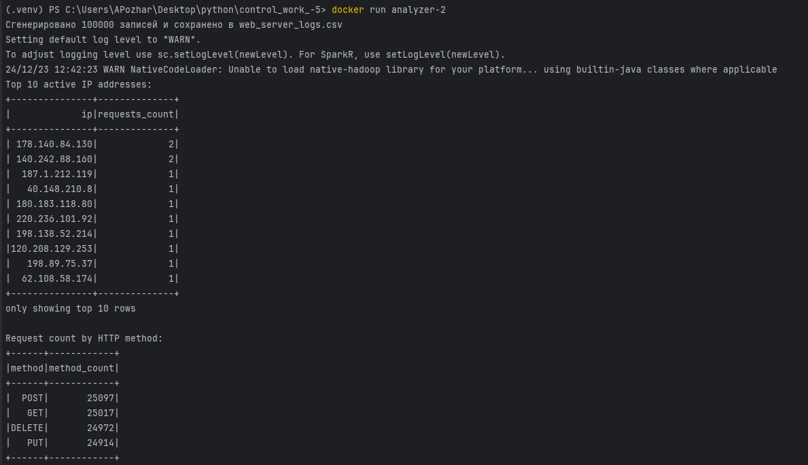
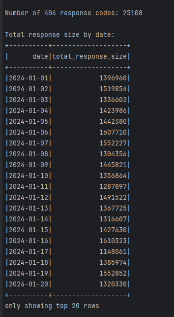

# Контрольная работа №5 Курс ["Data Engineer с нуля до junior"](https://stepik.org/course/137235/syllabus)

В данной задаче выполняются следующие функции:
- Генерация логов сервера
- Чтения файла (.csv) с логами PySpark'ом
- Анализ логов

В анализе требуется предоставить:
1. Сгруппируйте данные по IP и посчитайте количество запросов для каждого IP, выводим 10 самых активных IP. Формат вывода, как на скрине ниже.
2. Сгруппируйте данные по HTTP-методу и посчитайте количество запросов для каждого метода.
3. Профильтруйте и посчитайте количество запросов с кодом ответа 404.
4. Сгруппируйте данные по дате и просуммируйте размер ответов, сортируйте по дате.

Пример отработки проекта:




## Запуск проекта
Для запуска проекта потребуется установить **Docker** и **Git**.  
Инструкция по установке Docker [тут](https://www.docker.com/).  
Инструкция по установке Git [тут](https://git-scm.com/downloads).

1. Скачать проект 
```shell
git clone https://github.com/lexa946/control_work_-5.git 
```

2. Собираем образ докера 
```shell
docker build -t "analyzer-2" .
```

3. Запускаем проект
```shell
docker run analyzer-2
```
